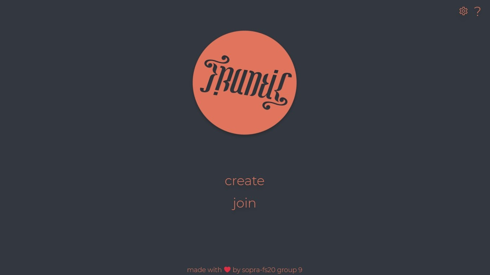
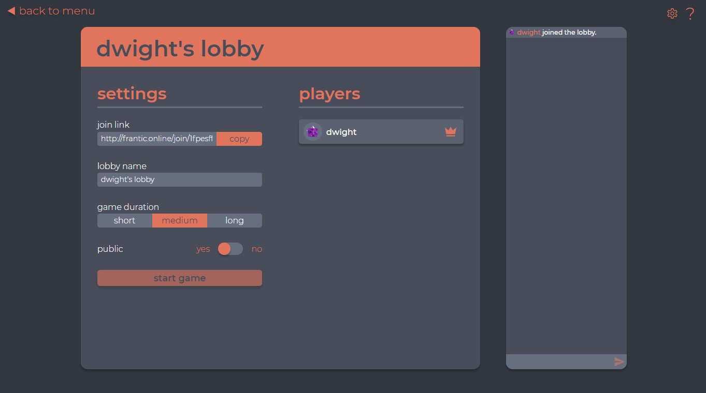
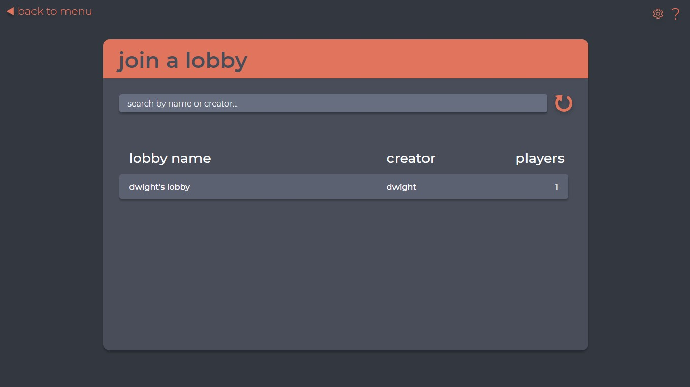

<h1 align="center">
   
  
   
  Frantic-Client
   
</h1>

  
  
  

## Introduction

Frantic is a chaotic card game created by [Rulefactory](https://rulefactory.ch). This repository is the front-end part of an online implementation for this card game. 

Please find the current build under http://frantic.online/.

## Technologies

To establish a connection between the front- and backend REST is used. When further proceeding in the game (joining a lobby), a websocket connection gets established.

## High-level Components

The [LobbyBrowserView](src/components/views/LobbyBrowserView.js) displays all public lobbies. It only uses REST-requests to update the list. Internally, the lobby elements are anchors to their individual join links. When the user clicks on the lobby, they get redirected to the LobbyView, which then sends the corresponding requests and then establishes a WebSocks connection.

The [LobbyView](src/components/views/LobbyView.js) sends a POST-Request to create a lobby, then opens a WebSocket connection. It contains the [LobbyWindow](src/components/ui/lobby/LobbyWindow.js), which contains everything lobby related (chat, settings etc). To start the game, the LobbyWindow sends a package to the Backend and upon confirmation redirects the user to the GameView.

The [GameView](src/components/views/GameView.js) handles all in-game packages (card effects, events etc). It recieves the game state and renders the view accordingly. An example of this is the [PlayerHand](src/components/ui/ingame/PlayerHand.js). It displays the cards of the player. The PlayerHand notifies the GameView when a card has been played, in return the GameView determines which cards the PlayerHand displays. It gets rendered according to the game state. 

All views are embedded in an [AppContainer](src/components/ui/AppContainer.js). AppContainer's can display the back, settings and help buttons. If the according buttons are enabled, the AppContainer also handles rendering and overlaying Help -and Settings windows.

## Launch & Development

* `npm run dev`

  Runs the app in the development mode. 
  Open [http://localhost:3000](http://localhost:3000) to view it in the browser.

  The page will reload if you make edits. 
  You will also see any lint errors in the console.

* `npm run build`

  Builds the app for production to the `build` folder. 
  It correctly bundles React in production mode and optimizes the build for the best performance.

  The build is minified and the filenames include the hashes. 
  Your app is ready to be deployed!

  See the section about [deployment](https://facebook.github.io/create-react-app/docs/deployment) for more information.
  
 ## Screenshots
  
 When visiting the site, the menu screen appears where one can choose either to create or join a game. 
  
 
  
 When creating a game, the player is asked to enter a username and choose the settings for the game.
  
 
  
 When joining a game a player is redirected to the lobby browser, where a lobby can be joined.
  
 
  
 Once there are enough players (more than one) in a lobby the host can start the game.
  
 
  
 During every phase of this process a player can visit the help page to read the rule set or special effects of cards.
  
 ## Roadmap
  
 1.Implement the expansion pack  
 2.Minor bug fixes
 3.Mobile version?
  
 ## Authors and Acknowledgements
  
 ### Members of the SoPra-group 09 2020:
  
 [Kyrill Hux](https://github.com/realChesta), [Jan Willi](https://github.com/JaanWilli), [Davide Fontanella](https://github.com/Davfon), [Remy Egloff](https://github.com/regloff), [Sina Krumhard](https://github.com/sei-nah)
  
 ### Acknowledgements
  
First of all we want to thank Rulefactory for creating such an amazing game. We all had a fun time implementing the game, and also learned a lot.  
Further we would like to thank our tutor Moritz Eck, who always provided useful advice to get cleaner code and more user-friendliness. We are also very grateful for our friends and families for testing our game extensively and also providing improvements in terms of user friendlyness.
